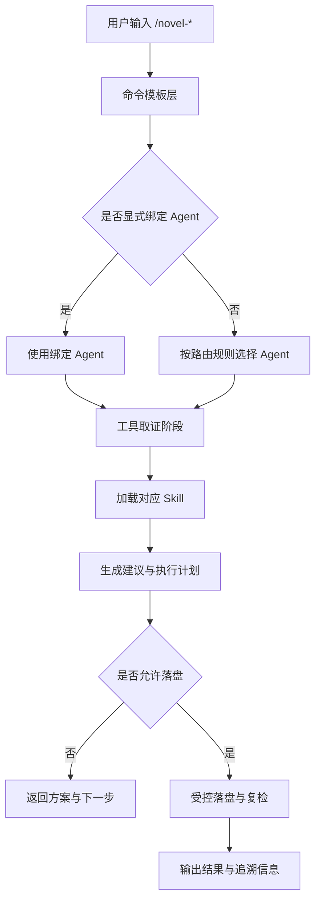

# 工作流（OpenCode TUI：从 0 到可交付）

> 在 OpenCode 中打开小说项目目录后，按顺序执行 `/novel-*` 命令即可。

## 0) 安装（一次性）

在插件仓库目录执行：

- `bun install`
- `bun run build`
- `bun run script/install-opencode.ts -- --target=global`

然后重启 OpenCode。

## 1) 初始化项目

- 运行：`/novel-init "书名"`
- 生成：
  - `manuscript/`（事实源）
  - `.opencode/novel/`（派生目录）
  - `.opencode/novel/profile.md`（类型画像，默认 compact）
  - `.opencode/novel.jsonc`（项目配置）

## 2) 配置校验（推荐）

- 运行：`/novel-config-check`
- 作用：检查默认/用户/项目配置合并结果，返回结构化诊断（`source/path/message`）
- 通过后再进入索引与导出流程

## 3) 导入（可选）

已有草稿可执行：

- `/novel-import`（不改原文，拆章写入 `manuscript/chapters/*.md`）
- 然后执行 `/novel-index`

## 4) 索引与巡检

- `/novel-index`
  - 默认启用增量缓存：`.opencode/novel/cache/scan.json`
  - 输出含 cache 命中统计（hits/misses）
  - 可选性能基线：`bun run benchmark:index -- --chapters=500 --repeats=5`
- `/novel-continuity-check`
- `/novel-foreshadowing-audit`
- `/novel-style-check`

## 5) 写作链（默认不覆盖原章）

推荐顺序：

1. `/novel-chapter-plan <chapter_id> [--apply] [--skip-profile]`
2. `/novel-chapter-draft <chapter_id> [--apply]`
3. `/novel-chapter-review <chapter_id>`
4. `/novel-polish <chapter_id> [--apply]`

默认行为：

- 不覆盖 `manuscript/chapters/<chapter_id>.md`
- 产物写入派生文件：`.plan.md` / `.draft.md` / `.continue.md` / `.rewrite.md` / `.polish.md`
- 仅在显式 `--apply` 且确认后才覆盖原章
- 默认优先读取 `profile.md`，缺失时自动补跑 compact 画像

## 6) Candidates 受控落盘（可选）

1. `/novel-extract-entities` 生成 `candidates.json`
2. `/novel-apply-candidates` 执行受控落盘
   - 默认 `dryRun=true`
   - 建议真实落盘前加 `snapshot=true snapshotTag=...`
   - 默认仅 patch frontmatter，不改正文

## 7) 导出交付

- `/novel-export [md|html|epub|docx]`
- 可启用预检门禁：
  - `export.preflight.enabled = true`
  - `export.preflight.checks = ["index","continuity","foreshadowing","style"]`
  - `export.preflight.failOn = "error" | "warn"`
- 成功导出后会生成 `*.manifest.json`
  - 包含章节与导出文件 `sha256`
  - 用于跨环境可复现对账

## 8) 快照（阶段冻结）

- `/novel-snapshot <tag>`
- 汇总 bible + 派生报告到 `manuscript/snapshots/`

## 9) 命令 → Agent → Tool → Skill 交互流

默认路由规则：

- 显式绑定优先（当前实现）：
  - `/novel-init`、`/novel-import`、`/novel-bootstrap`、`/novel-continuity-check`、`/novel-foreshadowing-audit` → `novel-sentinel`
  - `/novel-outline` → `novel-muse`
  - `/novel-chapter-review` → `novel-editor`
- 未显式绑定时：
  - 巡检、索引、修复类优先 `novel-sentinel`
  - 创意、规划、分支类优先 `novel-muse`
  - 审校、改稿建议类优先 `novel-editor`

交互约束：

- 必须先调用工具获取事实，再调用 skills 生成结论。
- 标签画像允许 `compact`（不完整）模式，命令层需降级兼容。
- 标签判定推荐固定顺序：六维分类 → `profile-aggregator` → 内容专家 skill。
- 内容建议必须可追溯到工具结果与目标文件，不得无依据下结论。

## 10) 输出协议（对接建议）

- 所有 `/novel-*` 工具命令统一输出：`Summary`、`Result (Structured)`、`Diagnostics`、`Next Steps`
- `Result (Structured)` 至少包含：`version`、`schemaVersion`（当前值一致）
- 对接方建议优先按 `schemaVersion` 分支处理，缺失时回退 `version`
- `novel-index` 结果包含 `generatedAt` 与 `scanScope`，可用于“生成时间/扫描范围”审计
